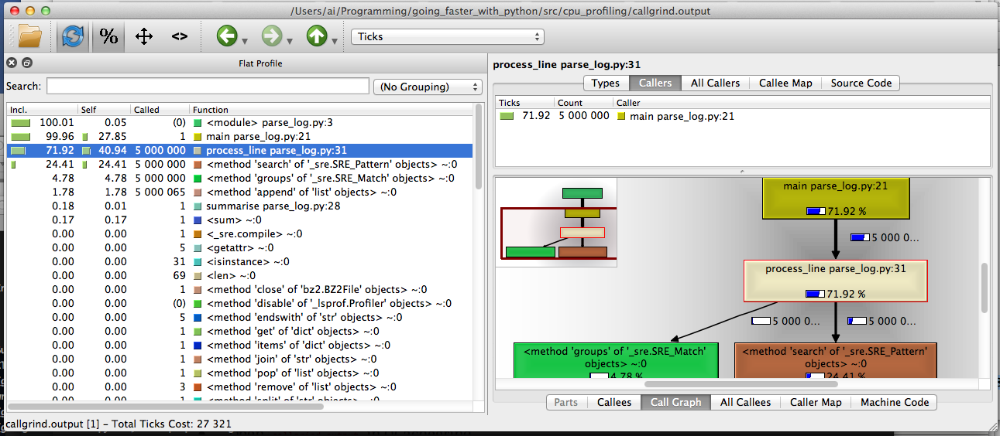
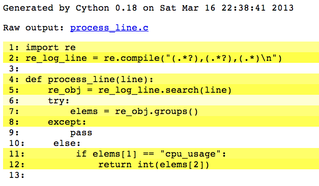
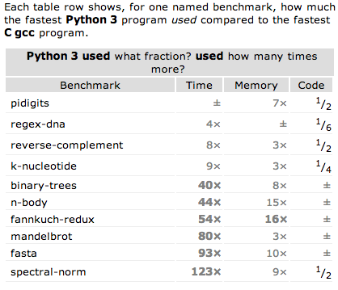
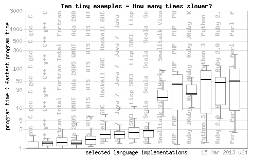
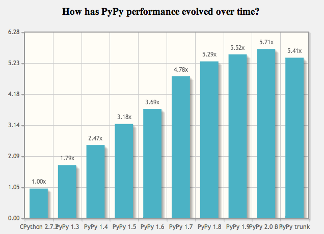

## Contents

-   Case study: Log Parsing
-   When to optimise
-   Where to optimise
-   How to optimise

--- &vcenter .large

Much more is online.

[http://asimihsan.com](http://asimihsan.com)

--- .contents_section_1

## Contents

-   Case study: Log Parsing
-   When to optimise
-   Where to optimise
-   How to optimise

---

## Log Parsing

-   Input: bzip-compressed log file.
    -   Format: `epoch,metric,value`

            1362331306,cpu_usage,74
            1362331307,memory_usage,1396
            1362331308,cpu_usage,13
            ...

-   Output: arithmetic mean of CPU usage.
    -   Metric = `cpu_usage`

---

## Code caveat

-   This purpose of this presentation **is not** "how do I parse this log file the fastest?".
    -   The code that follows is **deliberately obtuse and non-idiomatic**.
-   I'd like you to take several **core priciples** away.
-   Pedagogy is very difficult! How do you teach principles without overly difficult examples?

---

```python
re_log_line = re.compile("(.*?),(.*?),(.*)\n")

def main():
    cpu_usages = []
    with contextlib.closing(bz2.BZ2File(log_filepath)) as f_in:
        for line in f_in:
            process_line(line, cpu_usages)
    summarise(cpu_usages)

def summarise(cpu_usages):
    print "avg: %s" % (sum(cpu_usages) / len(cpu_usages), )

def process_line(line, cpu_usages):
    re_obj = re_log_line.search(line)
    try:
        elems = re_obj.groups()
    except:
        pass
    else:
        if elems[1] == "cpu_usage":
            cpu_usages.append(int(elems[2]))
```

--- .contents_section_2

## Contents

-   Case study: Log Parsing
-   When to optimise
-   Where to optimise
-   How to optimise

--- &vcenter

> Premature optimization is the root of all evil. --Donald Knuth

--- &vcenter

> "Programmers waste enormous amounts of time thinking about, or
 worrying about, the speed of noncritical parts of their
 programs, and these attempts at efficiency actually have a
 strong negative impact when debugging and maintenance are
 considered. **We should forget about small efficiencies**, say
 about 97% of the time: premature optimization is the root of
 all evil. **Yet we should not pass up our opportunities in that
 critical 3%**." --Donald Knuth

---

## When to optimise

1.   Get it right.
2.   Test it's right.
3.   Profile if slow.
4.   **Optimise**.
5.   Go to step 2.

---

## When to optimise

-   ...but there's "getting it right" and "getting it right".
-   How easy will you make your life *if you do need to optimise*?
-   Can you make it easier?
-   Components.
-   Interfaces.

--- &vcenter

> “If there’s a moral to this story, it is this: do not let performance considerations stop you from doing what is right. You can always make the code faster with a little cleverness. You can rarely recover so easily from a bad design...**Design the program you want in the way it should be designed. Then, and only then, should you worry about performance**. More often than not, you’ll discover the program is fast enough on your first pass.” –Elliotte Rusty Harold

(from Chapter 5 (Correct, Beautiful, Fast) in [*Beautiful Code*](http://shop.oreilly.com/product/9780596510046.do) by O'Reilly, an extraordinary book).

--- .contents_section_3

## Contents

-   Case study: Log Parsing
-   When to optimise
-   Where to optimise
-   How to optimise

---

## Where to optimise

-   `cProfile` is a great built-in deterministic profiler.
    -   **deterministic** $\Rightarrow$ comprehensive; observer effect!
-   `kcachegrind` is the most user-friendly way to explore call graphs.
-   `line_profiler` has even higher overhead, but allows you line-by-line insight.

*** pnotes

-   Article has more detail is more comprehensive.
-   This is just a list of favourites.

---

## `cProfile` from CLI

```
python -m cProfile -o profile.stats parse_log.py
```

-   Outputs `profile.stats` to current directory.
-   Can get a list of "hot functions" quite easily:

```
python -c "import pstats; p = pstats.Stats('profile.stats'); p.sort_stats('time').print_stats(5)"

   ncalls  tottime  percall  cumtime  percall filename:lineno(function)
  5000000   12.930    0.000   23.044    0.000 cpu_profiling/parse_log.py:31(process_line)
        1    8.666    8.666   31.756   31.756 cpu_profiling/parse_log.py:21(main)
  5000000    7.917    0.000    7.917    0.000 {method 'search' of '_sre.SRE_Pattern' objects}
  5000000    1.621    0.000    1.621    0.000 {method 'groups' of '_sre.SRE_Match' objects}
  5000065    0.575    0.000    0.575    0.000 {method 'append' of 'list' objects}
```

---

```
   ncalls  tottime  percall  cumtime  percall filename:lineno(function)
  5000000   12.930    0.000   23.044    0.000 cpu_profiling/parse_log.py:31(process_line)
        1    8.666    8.666   31.756   31.756 cpu_profiling/parse_log.py:21(main)
  5000000    7.917    0.000    7.917    0.000 {method 'search' of '_sre.SRE_Pattern' objects}
  5000000    1.621    0.000    1.621    0.000 {method 'groups' of '_sre.SRE_Match' objects}
  5000065    0.575    0.000    0.575    0.000 {method 'append' of 'list' objects}
```

-   Program took 31.756s to run.
-   **`tottime`**: total time spent in function *excluding* calls to subfunctions.
-   **`cumtime`**: total time spent in function *including* calls to subfunctions.
-   Note the obvious for `main`, that `cumtime = percall` and `ncalls = 1`.
-   Top three functions take $\frac{12.930+8.666+7.917}{31.756} \times 100 = 92.9\%$ of time.

---

```
   ncalls  tottime  percall  cumtime  percall filename:lineno(function)
  5000000   12.930    0.000   23.044    0.000 cpu_profiling/parse_log.py:31(process_line)
  5000000    7.917    0.000    7.917    0.000 {method 'search' of '_sre.SRE_Pattern' objects}
  5000000    1.621    0.000    1.621    0.000 {method 'groups' of '_sre.SRE_Match' objects}
  5000065    0.575    0.000    0.575    0.000 {method 'append' of 'list' objects}

def process_line(line, cpu_usages):
    re_obj = re_log_line.search(line)
    try:
        elems = re_obj.groups()
    except:
        pass
    else:
        if elems[1] == "cpu_usage":
            cpu_usages.append(int(elems[2]))
```

-   `process_line` takes $\frac{12.930}{31.756} \times 100 = 40.7\%$ of the time **excluding** calls to subfunctions.

---

```
   ncalls  tottime  percall  cumtime  percall filename:lineno(function)
        1    8.666    8.666   31.756   31.756 cpu_profiling/parse_log.py:21(main)

def main():
    cpu_usages = []
    with contextlib.closing(bz2.BZ2File(log_filepath)) as f_in:
        for line in f_in:
            process_line(line, cpu_usages)
    summarise(cpu_usages)
```

-   `main` takes $\frac{8.666}{31.756} \times 100 = 27.3\%$ of time, **excluding** calls to subfunctions.
-   Why? Stay tuned :)

---

```
   ncalls  tottime  percall  cumtime  percall filename:lineno(function)
  5000000   12.930    0.000   23.044    0.000 cpu_profiling/parse_log.py:31(process_line)
        1    8.666    8.666   31.756   31.756 cpu_profiling/parse_log.py:21(main)
  5000000    7.917    0.000    7.917    0.000 {method 'search' of '_sre.SRE_Pattern' objects}
  5000000    1.621    0.000    1.621    0.000 {method 'groups' of '_sre.SRE_Match' objects}
  5000065    0.575    0.000    0.575    0.000 {method 'append' of 'list' objects}

def main():
    cpu_usages = []
    with contextlib.closing(bz2.BZ2File(log_filepath)) as f_in:
        for line in f_in:
            process_line(line, cpu_usages)
    summarise(cpu_usages)

def summarise(cpu_usages):
    print "avg: %s" % (sum(cpu_usages) / len(cpu_usages), )
```

-   And...where is `summarise`?!
-   Correct answer: at the moment **it is completely irrelevant**.

---

## `kcachegrind`

-   Download KCachegrind source, build QT GUI called `QCachegrind`.
-   Generate a `cProfile` output file, as before.
-   `pip install pyprof2calltree`
-   `pyprof2calltree -i profile.stats -o callgrind.output`
-   Open `callgrind.output` in `QCachegrind`

--- &vcenter



--- 

## `line_profiler`

```python
(going_faster_with_python)Mill:src ai$ kernprof.py -l -v cpu_profiling/parse_log_line_profiler.py

File: cpu_profiling/parse_log_line_profiler.py
Function: main at line 21
Total time: 105.217 s

Line #      Hits         Time  Per Hit   % Time  Line Contents
==============================================================
    21                                           @profile
    22                                           def main():
    23         1            2      2.0      0.0      cpu_usages = []
    24         1           34     34.0      0.0      with contextlib.closing(bz2.BZ2File(log_filepath)) as f_in:
    25   5000001     11602598      2.3     11.0          for line in f_in:
    26   5000000     93565103     18.7     88.9              process_line(line, cpu_usages)
    27         1        49088  49088.0      0.0      summarise(cpu_usages)
```

-   Nothing surprising.   

---

```python
File: cpu_profiling/parse_log_line_profiler.py
Function: process_line at line 32
Total time: 44.2081 s

Line #      Hits         Time  Per Hit   % Time  Line Contents
==============================================================
    32                                           @profile
    33                                           def process_line(line, cpu_usages):
    34   5000000     14758591      3.0     33.4      re_obj = re_log_line.search(line)
    35   5000000      4406648      0.9     10.0      try:
    36   5000000      6765236      1.4     15.3          elems = re_obj.groups()
    37                                               except:
    38                                                   pass
    39                                               else:
    40   5000000      5814440      1.2     13.2          if elems[1] == "cpu_usage":
    41   5000000     12463137      2.5     28.2              cpu_usages.append(int(elems[2]))
```

-   `try` takes up time, and line 41 is opaque

--- .contents_section_4

## Contents

-   Case study: Log Parsing
-   When to optimise
-   Where to optimise
-   How to optimise

---

## How to optimise

-   Empathising with CPython
-   CPython and `Cython`
-   CPython and `CFFI`
-   PyPy
-   PyPy and `Cython`
-   PyPy and `CFFI`

---

## CPython

-   Many patterns are surprisingly slow in CPython.
    -   But which patterns?

>   **"In God we trust; all others bring data"** [The Elements of Statistical Learning, part of machine learning canon]

-   `timeit`: for timing short code segments
-   `dis`: for taking a peek at the CPython bytecode for code segments
-   For reference, my platform: 1.8 GHz Intel Core i7 4-cores, Mac OS X 10.8.2 64-bit, 4GB 1333 MHz DDR3 RAM, CPython 2.7.3, PyPy 2.0 beta 1, CFFI 0.5, Cython 0.18, gcc 4.7.2

---

## `timeit` on original code

```python
In [1]: def main():
   ...:     # <snip>
   ...:     with contextlib.closing(bz2.BZ2File(log_filepath)) as f_in:
   ...:         for line in f_in:
   ...:             process_line(line, cpu_usages)

In [2]: timeit.timeit("main()", setup="from __main__ import main", number=3) / 3
Out[2]: 29.2360786596934
```

-   There's not much going on here...or is there?

---

## `map` vs. `for`

```
In [4]: def main_2():
   ...:     # <snip>
   ...:     with contextlib.closing(bz2.BZ2File(log_filepath)) as f_in:
   ...:         cpu_usages = map(process_line, f_in)

In [5]: timeit.timeit("main_2()", setup="from __main__ import main_2", number=3) / 3
Out[5]: 22.399725993474323 
```

-   $\frac{22.4 - 29.2}{29.2} \times 100 \approx 23\%$ faster.
-   Why? What is `map` doing, if not exactly what `for` is?
-   Wrong question. Not what, but **how**?

--- .constrain_code &twocol_uncentered 

## `map` vs. `for`

*** left

```python
In [1]:  def f1(iterable):
  ....:      return map(function, iterable)
In [2]: dis.dis(f1)
  2           0 LOAD_GLOBAL              0 (map)
              3 LOAD_GLOBAL              1 (function)
              6 LOAD_FAST                0 (iterable)
              9 CALL_FUNCTION            2
             12 RETURN_VALUE
```

-   `map` isn't written in Python!
-   Defer expensive operations to C modules, especially built-ins. 

*** right

```python
In [3]:  def f2(iterable):
  ....:      return_value = []
  ....:      for element in iterable:
  ....:          return_value.append(function(element))
  ....:      return return_value

In [4]: dis.dis(f2)
  2           0 BUILD_LIST               0
              3 STORE_FAST               1 (return_value)

  3           6 SETUP_LOOP              33 (to 42)
              9 LOAD_FAST                0 (iterable)
             12 GET_ITER            
        >>   13 FOR_ITER                25 (to 41)
             16 STORE_FAST               2 (element)

  4          19 LOAD_FAST                1 (return_value)
             22 LOAD_ATTR                0 (append)
             25 LOAD_GLOBAL              1 (function)
             28 LOAD_FAST                2 (element)
             31 CALL_FUNCTION            1
             34 CALL_FUNCTION            1
             37 POP_TOP             
             38 JUMP_ABSOLUTE           13
        >>   41 POP_BLOCK           
        >>   42 LOAD_CONST               0 (None)
             43 RETURN_VALUE        
             46 RETURN_VALUE
```

--- .constrain_code &twocol_uncentered 

## list comprehension vs. `for`

*** left

```python
In [1]:  def f3(iterable):
  ....:      return [function(elem) for elem in iterable]
In [2]:  dis.dis(f3)
  2           0 BUILD_LIST               0
              3 LOAD_FAST                0 (iterable)
              6 GET_ITER            
        >>    7 FOR_ITER                18 (to 28)
             10 STORE_FAST               1 (elem)
             13 LOAD_GLOBAL              0 (function)
             16 LOAD_FAST                1 (elem)
             19 CALL_FUNCTION            1
             22 LIST_APPEND              2
             25 JUMP_ABSOLUTE            7
```

-   Prefer list comprehensions to regular `for` loops.

*** right

```python
In [3]:  def f2(iterable):
  ....:      return_value = []
  ....:      for element in iterable:
  ....:          return_value.append(function(element))
  ....:      return return_value

In [4]: dis.dis(f2)
  2           0 BUILD_LIST               0
              3 STORE_FAST               1 (return_value)

  3           6 SETUP_LOOP              33 (to 42)
              9 LOAD_FAST                0 (iterable)
             12 GET_ITER            
        >>   13 FOR_ITER                25 (to 41)
             16 STORE_FAST               2 (element)

  4          19 LOAD_FAST                1 (return_value)
             22 LOAD_ATTR                0 (append)
             25 LOAD_GLOBAL              1 (function)
             28 LOAD_FAST                2 (element)
             31 CALL_FUNCTION            1
             34 CALL_FUNCTION            1
             37 POP_TOP             
             38 JUMP_ABSOLUTE           13
        >>   41 POP_BLOCK           
        >>   42 LOAD_CONST               0 (None)
             43 RETURN_VALUE        
             46 RETURN_VALUE
```

--- .contents_section_2

## How to optimise

-   Empathising with CPython
-   CPython and `Cython`
-   CPython and `CFFI`
-   PyPy
-   PyPy and `Cython`
-   PyPy and `CFFI`

---

## `Cython`

-   A strict superset of regular Python code.
-   `Cython` compiles it to C code, then defers to the C compiler to do optimisations.
-   Steps:
    1.  Extract a "hot" function into a PYX file.
    2.  Create an appropriate `setup.py` file to build it.
    2.  Annotate the PYX with type information.
    3.  ???
    4.  Profit!

--- .constrain_code &twocol_uncentered 

## `Cython`: brain-dead first step

-   With no type annotation, no code modification, pop `process_line()` into its own module:

*** left

```python
# process_line.pyx

import re
re_log_line = re.compile("(.*?),(.*?),(.*)\n")

def process_line(line):
    re_obj = re_log_line.search(line)
    try:
        elems = re_obj.groups()
    except:
        pass
    else:
        if elems[1] == "cpu_usage":
            return int(elems[2])
```

*** right

```python
# setup.py

from distutils.core import setup
from distutils.extension import Extension
from Cython.Distutils import build_ext

ext_modules = [Extension("process_line", ["process_line.pyx"])]

setup(
    name = "process_line",
    cmdclass = {"build_ext": build_ext},
    ext_modules = ext_modules
)
```

---

## `Cython`: brain-dead first step

-   `Cython` generates a 69KB C file (!?!).
-   Using `time` to time three executions before and after:
    -   Before: 22.7s, 22.3s, 23.2s
    -   After: 18.2s, 17.3s, 16.8s
-   So $\frac{17.3-22.7}{22.7} \times 100 \approx 23.8\%$ improvement, zero effort.

---

## `Cython`: asking for advice

-   Using `cython -a process_line.pyx` you can ask `Cython` how "difficult" it finds certain lines, i.e. where it would appreciate some help.



---

## `Cython`: with annotations

-   Only one possible place to make annotations here:

```python
cpdef int process_line(char *line):
```

-   This doesn't offer any performance improvements.
-   Cython has already used automatic type-inference to improve this code.
    -   Numeric-heavy code can often be improved by orders of magnitude.

--- .contents_section_3

## How to optimise

-   Empathising with CPython
-   CPython and `Cython`
-   CPython and `CFFI`
-   PyPy
-   PyPy and `Cython`
-   PyPy and `CFFI`

---

## `CFFI`

-   `CFFI` is a new alternative to `ctypes`.
-   Relatively new project by the PyPy team.
    -   And they intend to re-write `ctypes` in `CFFI`.
-   `CFFI` is supported **by both** CPython and PyPy.
    -   PyPy 2.0 beta 1 is the first release to officially support `CFFI`.
-   Great thing about `CFFI`: it actually **looks like C**, so very easy to use (for C developers).

--- .constrain_code

## `CFFI`: replacing `process_line()`

```c
# _cffi_parse_log.py
from cffi import FFI

def _make_ffi_process_line():
    ffi = FFI()

    ffi.cdef(r"""
    int process_line(const char* line);
    """)

    lib = ffi.verify(r"""
    #include "pcre.h"

    static char* regex = "(.*?),(.*?),(.*)";
    static pcre* re;
    static pcre_extra* extra;

    pcre* compile_regexp(char* regexp) {
        const char* error;
        int erroffset;
        re = pcre_compile(regex,
                          0, // PCRE_UTF8,
                          &error,
                          &erroffset,
                          0);
        if (!re) {
            printf("pcre_compile failed (offset: %d), %s\n", erroffset, error);
        }
        return re;
    }

    pcre_extra* study_regexp(pcre* compiled_regexp) {
        const char* error;
        extra = pcre_study(re, PCRE_STUDY_JIT_COMPILE, &error);
        if (error != NULL) {
            printf("pcre_study failed: '%s'\n", error);
        }
        return extra;
    }

    int process_line(const char* line) {
        int rc, i;
        const int MAX_OFFSETS = 30;
        const char* value;
        const char* metric;
        static char* cpu_usage = "cpu_usage";
        int metric_len;
        if (!re) {
            re = compile_regexp(regex);
            extra = study_regexp(re);
        }
        int offsets[MAX_OFFSETS];
        rc = pcre_exec(re, extra, line, strlen(line), 0, 0, offsets, MAX_OFFSETS);
        if (rc < 0) {
            if (rc == PCRE_ERROR_NOMATCH) printf("Did not match\n");
            else printf("Matching error %d\n", rc);
            return -1;
        }
        pcre_get_substring(line, offsets, rc, 2, &(metric));
        metric_len = offsets[2*2+1] - offsets[2*2];
        if (!strncmp(metric, cpu_usage, metric_len)) {
            pcre_get_substring(line, offsets, rc, 3, &(value));
            return atoi(value);
        }
        return -1;
    };
    """, libraries=['c', 'pcre'])

    return lib.process_line
```

---

## `CFFI`: replacing `process_line()`

-   It's written to be a drop-in replacement:

```python
import _cffi_parse_log
process_line = _cffi_parse_log._make_ffi_process_line()

def main():
    with contextlib.closing(bz2.BZ2File(log_filepath)) as f_in:
        cpu_usages = map(process_line, f_in)
    summarise(cpu_usages)
```

---

## `CFFI`: replacing `process_line()`

-   Recall the speeds of the Python code with `map`: 22.7s, 22.3s, 23.2s
-   Recall the speeds of the `Cython` version: 18.2s, 17.3s, 16.8s
-   The `CFFI` speeds: 11.7s, 11.7s, 12.0s
-   `CFFI` after re-compiling `pcre` with `--enable-jit` and then using JIT gives: 6.7s, 6.9s, 6.8s
-   `CFFI` with `pcre` JIT'ing and `gcc` profiling (`-fprofile-generate`, run, `-fprofile-use`): 6.4s, 6.5s, 6.4s

---

## `CFFI`: replacing `process_line()`

-   CFFI is $\frac{11.7-22.7}{22.7} \approx 48\%$ faster than the Python version.
-   CFFI with JIT `pcre` is $\frac{6.9-22.7}{22.7} \approx 70\%$ faster than the Python version.
-   CFFI with JIT `pcre` and `gcc` profiling is $\frac{6.4-22.7}{22.7} \approx 72\%$ faster than the Python version.
-   For larger, more complex (i.e. real) examples:
    -   `pcre` JIT'ing is even better; complex regular expressions give better yields.
    -   `gcc` profiling is even better; branch probability hints work better if there are shed-loads of branches, loop unrolling hints with lots of loops, etc.!

--- &twocol_uncentered

## You can have your cake and eat it too

-   Python: less code, more declarative and functional.
-   C: the undisputed king of the hill, easy to write the code, more difficult to structure and maintain entire programmes.

*** left



*** right



--- .contents_section_4

## How to optimise

-   Empathising with CPython
-   CPython and `Cython`
-   CPython and `CFFI`
-   PyPy
-   PyPy and `Cython`
-   PyPy and `CFFI`

---

## PyPy

-   PyPy is the future...



---

## PyPy

-   ...except right now, if you use `bzip2` or `gzip`, you're SOL.
-   [Issue 770](https://bugs.pypy.org/issue770) tracks `bzip2` being "200%" slower in PyPy.
-   However, for this presentation I've been unable to see my `parse_log.py` script **ever finish** when running PyPy (left it running overnight).
    -   Lucky for me; makes this section really short! :)

--- .contents_section_5

## How to optimise

-   Empathising with CPython
-   CPython and `Cython`
-   CPython and `CFFI`
-   PyPy
-   PyPy and `Cython`
-   PyPy and `CFFI`

---

## PyPy and `Cython`

-   This doesn't end well, and probably will never get better.
-   `Cython` compiles down to a C API that directly manipulates various CPython objects.
-   PyPy is able to talk to the CPython C API objects via a module called `cpyext`.
-   However, this module reduces `Cython`'s performance by $\approx$ two orders of magnitude.
-   So, yet again, you're SOL!

--- .contents_section_6

## How to optimise

-   Empathising with CPython
-   CPython and `Cython`
-   CPython and `CFFI`
-   PyPy
-   PyPy and `Cython`
-   PyPy and `CFFI`

---

## PyPy and `CFFI`

-   Officially supported on PyPy 2.0 beta 1 (time of writing, released about a month ago).
-   Very exciting times! I really do think this is the future.
-   (Perhaps, yes, I could have written a `bzip2` routine in `CFFI`...egh!)

---

## Conclusion

-   Get it right, check it's right, profile.
-   Defer to built-ins and C extensions, especially in tight loops.
-   Cython is awesome and cheap to try...for CPython only!
-   CFFI is awesome and a bit expensive to try...for CPython and PyPy!

--- &vcenter .large

Thank you!  

